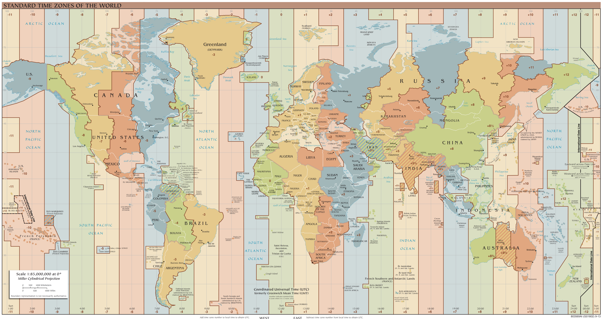
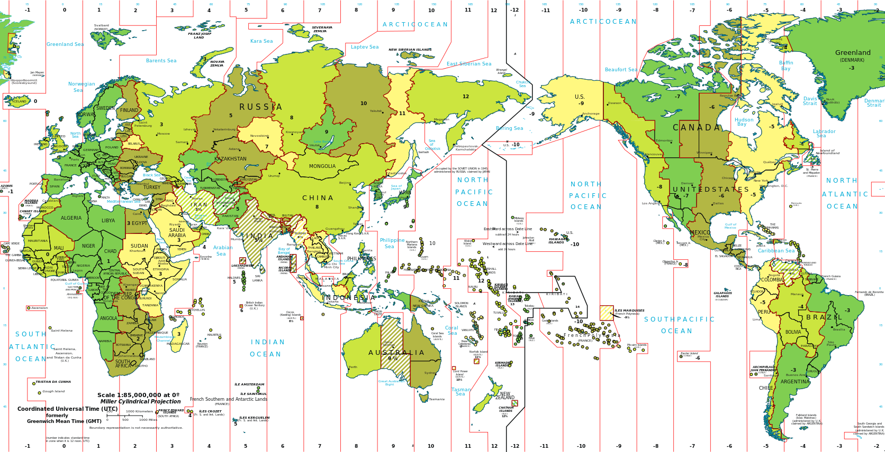

## 1. 时区的概念

### 1.1 时区简介

　　地球是自西向东自转，东边比西边先看到太阳，东边的时间也比西边的早。东边时刻与西边时刻的差值不仅要以时计，而且还要以分和秒来计算，这给人们带来不便。所以为了克服时间上的混乱，1884年在[华盛顿](https://baike.sogou.com/lemma/ShowInnerLink.htm?lemmaId=64503567&ss_c=ssc.citiao.link)召开的一次国际经度会议（又称国际[子午线](https://baike.sogou.com/lemma/ShowInnerLink.htm?lemmaId=3445356&ss_c=ssc.citiao.link)会议）上，规定将全球划分为24个时区(东、西各12个时区)。规定英国（[格林尼治天文台](https://baike.sogou.com/lemma/ShowInnerLink.htm?lemmaId=423342&ss_c=ssc.citiao.link)旧址）为中时区（零时区）、东1-12区，西1-12区。每个时区横跨经度15度，时间正好是1小时。最后的东、西第12区各跨经度7.5度，以东、西经180度为界。每个时区的中央经线上的时间就是这个时区内统一采用的时间，称为区时，相邻两个时区的时间相差*1*小时。例如，中国东8区的时间总比泰国东7区的时间早1小时，而比日本东9区的时间迟1小时。因此，出国旅行的人，必须随时调整自己的手表，才能和当地时间相一致。凡向西走，每过一个时区，就要把表拨慢1小时（比如2点拨到1点）；凡向东走，每过一个时区，就要把表拨快1小时（比如1点拨到2点）。并且规定英国（格林尼治天文台旧址）为[本初子午线](https://baike.sogou.com/lemma/ShowInnerLink.htm?lemmaId=136319&ss_c=ssc.citiao.link)，即零时（24时）经线。

　　实际上，世界上不少国家和地区都不严格按时区来计算时间。但为了在全国范围内采用统一的时间，一般都把某一个时区的时间作为全国统一采用的时间。例如，中国把首都北京所在的东8区的时间作为全国统一的时间，称为北京时间。又例如，法国、荷兰和比利时等国，虽然地处中时区，但为了和欧洲大多数国家时间相一致，则采用东1区的时间。






### 1.2 世界各城市时间查询

　　查询网站：https://www.timeanddate.com/

## 2. GMT、UTC、CST、DST 时间

### 2.1 UTC

 　整个地球分为二十四时区，每个时区都有自己的本地时间。在国际无线电通信场合，为了统一起见，使用一个统一的时间，称为通用协调时(UTC, Universal Time Coordinated)。

### 2.2 GMT

 　格林威治标准时间 (Greenwich Mean Time)指位于英国伦敦郊区的皇家格林尼治天文台的标准时间，因为本初子午线被定义在通过那里的经线。(UTC与GMT时间基本相同，本文中不做区分)

### 2.3 CST

 　中国标准时间 (China Standard Time) UTC = GMT = CST - 8 

### 2.4 DST

 　夏令时(Daylight Saving Time) 指在夏天太阳升起的比较早时，将时间拨快一小时，以提早日光的使用。（中国不使用）

## 3. 硬件时间和系统时间

### 3.1 硬件时间

　　RTC（Real-Time Clock）或CMOS时间，一般在主板上靠电池供电，服务器断电后仍然继续运行。仅保存日期时间数值，无法保存时区和夏令时设置。

### 3.2 系统时间

　　一般在服务器启动时复制RTC时间，之后独立运行，保存了时间、时区和夏令时设置。

## 4. CentOS7上的时间管理命令：timedatectl

### 4.1 timedatectl 选项

```
$ timedatectl --help
timedatectl [OPTIONS...] COMMAND ...

Query or change system time and date settings.

  -h --help                Show this help message
     --version             Show package version
     --no-pager            Do not pipe output into a pager
     --no-ask-password     Do not prompt for password
  -H --host=[USER@]HOST    Operate on remote host
  -M --machine=CONTAINER   Operate on local container
     --adjust-system-clock Adjust system clock when changing local RTC mode

Commands:
  status                   Show current time settings
  set-time TIME            Set system time
  set-timezone ZONE        Set system time zone
  list-timezones           Show known time zones
  set-local-rtc BOOL       Control whether RTC is in local time
  set-ntp BOOL             Control whether NTP is enabled
```

### 4.2 timedatectl 案例

查看当前系统时间、时区

```
$ timedatectl 
      Local time: Thu 2018-10-11 13:03:04 CST
  Universal time: Thu 2018-10-11 05:03:04 UTC
        RTC time: Thu 2018-10-11 01:17:11
       Time zone: Asia/Shanghai (CST, +0800)
     NTP enabled: no
NTP synchronized: no
 RTC in local TZ: no
      DST active: n/a

$ timedatectl status
      Local time: Thu 2018-10-11 13:03:09 CST
  Universal time: Thu 2018-10-11 05:03:09 UTC
        RTC time: Thu 2018-10-11 01:17:16
       Time zone: Asia/Shanghai (CST, +0800)
     NTP enabled: no
NTP synchronized: no
 RTC in local TZ: no
      DST active: n/a
```

列出全世界所有的时区

```
# timedatectl list-timezones | grep Asia
...
Asia/Hong_Kong
Asia/Shanghai
Asia/TaipeiAsia/Urumqi
...
```

设置时区

```
# 方法1：# 将时区设置为上海
$ timedatectl set-timezone Asia/Shanghai
# 方法2：# 直接修改符号链接
$ rm /etc/localtime$ ln -s ../usr/share/zoneinfo/Asia/Shanghai /etc/localtime 
```

设置时间

```
# 方法1：使用timedatectl，NTP enabled: yes时，使用了NTP服务器自动同步时间，若坚持要手动修改时间，先timedatectl set-ntp no。
# 设置日期和时间
$ timedatectl set-time '2018-10-11 09:00:00'
# 设置日期
$ timedatectl set-time '2018-10-11'
# 设置时间
$ timedatectl set-time '09:00:00'

# 方法2：使用date
$ date -s '2018-10-11 09:00:00'
```

同步系统时间到硬件时间

```
# 方法1：不建议硬件时间随系统时间变化
# 设置硬件时间随系统时间变化
$ timedatectl set-local-rtc 1
# 设置硬件时间不随系统时间变化
$ timedatectl set-local-rtc 0

# 方法2：
$ hwclock --systohc
```

是否启用自动同步时间

```
# 启用|停用自动同步时间
$ timedatectl set-ntp yes|no

# 上面的命令其实是启用、停用时间服务器，若安装了chrony服务，则等同于对该服务启停，若只安装了ntp，则是对ntp服务启停。
# 对chrony服务启停
$ systemctl start|stop chronyd
# 对ntp服务启停
$ systemctl start|stop ntpd
```

## 5. 自动同步时间：服务ntp、chrony，命令ntpdate

　　CentOS7之前采用ntp服务自动同步时间，CentOS7推荐使用chrony同步时间，当然ntp仍然可以使用，chrony官网列举了诸多chrony优于ntp的功能（[ntp与chrony的对比](https://chrony.tuxfamily.org/comparison.html)）。

　　此外我们若要立刻将系统时间同步为NTP服务时间，使用ntpdate命令，也可以配置计划任务定期使用ntpdate命令同步时间，从而就不用使用ntp或chrony服务，减少监听的端口，增加系统安全性。

### 5.1 ntp的安装配置

安装ntp

```
$ yum -y install ntp
```

配置ntp同步阿里云时间服务器

```
$ vim /etc/ntp.conf
...
server ntp1.aliyun.com
server ntp2.aliyun.com
server ntp3.aliyun.com
#server 0.centos.pool.ntp.org iburst
...
```

启动ntp服务器

```
$ systemctl start ntpd
```

### 5.2 chrony的安装配置

安装chrony

```
$ yum -y install chrony
```

配置chrony

```
$ vim /etc/chrony.conf
server ntp1.alyun.com
server ntp2.alyun.com
server ntp3.alyun.com
#server 0.centos.pool.ntp.org iburst...
```

启动chrony

```
$ systemctl start chronyd
```

### 5.3 配置计划任务，使用ntpdate同步时间

```
# 启动并开机启动计划任务cron
$ systemctl start crond
$ systemctl enable crond

# 配置计划任务，每5分钟同步一次
$ crontab -e
*/5 * * * * /usr/sbin/ntpdate ntp1.aliyun.com
```

## 6. 参考文章

[博客]  [centos7之关于时间和日期以及时间同步的应用](https://www.cnblogs.com/lei0213/p/8723106.html) 作者：[Charles.L](https://www.cnblogs.com/lei0213/)

[百科] [搜狗百科时区的介绍](https://baike.sogou.com/v3461006.htm?fromTitle=时区)

## 7 附录

### 附录一、国内常用的NTP时间源同步服务器汇总

使用以前请先ping相应的域名查看网络是否可达，和相应的访问速度

ntp.ntsc.ac.cn 　　中国国家授时中心
cn.ntp.org.cn 　　 中国授时

阿里云NTP时间源服务器
ntp1.aliyun.com
ntp2.aliyun.com
ntp3.aliyun.com
ntp4.aliyun.com
ntp5.aliyun.com
ntp6.aliyun.com
ntp7.aliyun.com

国内一些大学NTP时间源服务器
s1a.time.edu.cn 　　北京邮电大学
s1b.time.edu.cn 　　清华大学
s1c.time.edu.cn 　　北京大学
s1d.time.edu.cn 　　东南大学
s1e.time.edu.cn 　　清华大学
s2a.time.edu.cn 　　清华大学
s2b.time.edu.cn 　　清华大学
s2c.time.edu.cn 　　北京邮电大学
s2d.time.edu.cn 　　西南地区网络中心
s2e.time.edu.cn 　　西北地区网络中心
s2f.time.edu.cn 　　东北地区网络中心
s2g.time.edu.cn 　　华东南地区网络中心
s2h.time.edu.cn 　　四川大学网络管理中心
s2j.time.edu.cn 　　大连理工大学网络中心
s2k.time.edu.cn 　　CERNET桂林主节点
s2m.time.edu.cn 　　北京大学

另外，如果服务器在国外，苹果提供的公共NTP服务，以下7个域名
http://time1.apple.com
http://time2.apple.com
http://time3.apple.com
http://time4.apple.com
http://time5.apple.com
http://time6.apple.com
http://time7.apple.com

Google（谷歌）提供的NTP服务，以下4个域名
http://time1.google.com
http://time2.google.com
http://time3.google.com
http://time4.google.com