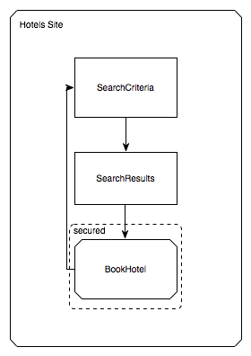

## 3. 定义流程

### 3.1. 介绍

本章从用户部分开始，介绍了如何使用流程定义语言去实现流程。从而让你在读完本章节之后能够很好的理解流程定义语言的结构以及有能力编写一个流程定义。

### 3.2. 流程是什么？

流程（Flow）封装了可在不同上下文中执行的可重用的一系列步骤。下面是一个“[Garrett Information Architecture](http://www.jjg.net/ia/visvocab/)”图，用于说明一个封装了酒店预订步骤的流程（Flow）：

### 3.3. 流程由什么组成？

在Spring Web Flow中，一个典型的流程由一系列称之为“states”的步骤组成。进入一个状态(state)通常会导致向用户显示一个视图。在该视图中，出现的一些 由状态(state)处理的用户事件。这些事件触发后可以转换到其它状态(state)，从而导致页面的导航。

下面的示例显示了上图引用的酒店预订流程的结构：

### 3.4. 如何编写流程？

流程（Flows）由web应用开发者使用一种简单的基于XML的流程定义语言编写而成。本指南的后续步骤将引导你了解流程定义语言的组成元素。

### 3.5. 基本语言元素

#### 3.5.1. flow

每一个流程都由下面的根元素（flow）开始：

~~~xml
<?xml version="1.0" encoding="UTF-8"?>
<flow xmlns="http://www.springframework.org/schema/webflow"
      xmlns:xsi="http://www.w3.org/2001/XMLSchema-instance"
      xsi:schemaLocation="http://www.springframework.org/schema/webflow
                          http://www.springframework.org/schema/webflow/spring-webflow.xsd">

</flow>
~~~

所有的流程状态(states)都必须在这个根元素内进行定义。该元素内定义的第一个状态(state)也是本流程的入口。

#### 3.5.2. view-state

使用`view-state`元素定义一个能够呈现页面视图的步骤：

~~~xml
<view-state id="enterBookingDetails" />
~~~

按照约定，`view-state`通过id映射到与流程定义文件同处一个目录的一个视图模板。举个简单的例子，如果`view-state`对应的流程定义文件存放在`/WEB-INF/hotels/booking`目录，那么上面的`view-state`将会渲染`/WEB-INFO/hotels/booking/enterBookingDetails.xhtml`模板内容。

#### 3.5.3. transition

使用`transition`元素来处理发生在状态(state)内的事件：

~~~xml
<view-state id="enterBookingDetails">
    <transition on="submit" to="reviewBooking" />
</view-state>
~~~

这些 transtions 驱动视图导航。

#### 3.5.4. end-state

使用`end-state`元素来定义流程结果：

~~~xml
<end-state id="bookingCancelled" />
~~~

当流程转换到`end-state`状态时，它将终止并返回结果。

#### 3.5.5. 检查点：基本语言元素

使用`view-state`,`transition`,`end-state`三个元素，你可以快速表达你的视图导航逻辑。团队在添加流程行为之前经常这么做，这样他们就可以首先专注于和最终用户开发应用的用户界面。下面展示了一个简单的流程，该流程使用以上三个元素实现了它的视图导航逻辑：

~~~xml
<flow xmlns="http://www.springframework.org/schema/webflow"
      xmlns:xsi="http://www.w3.org/2001/XMLSchema-instance"
      xsi:schemaLocation="http://www.springframework.org/schema/webflow
                          http://www.springframework.org/schema/webflow/spring-webflow.xsd">

    <view-state id="enterBookingDetails">
        <transition on="submit" to="reviewBooking" />
    </view-state>

    <view-state id="reviewBooking">
        <transition on="confirm" to="bookingConfirmed" />
        <transition on="revise" to="enterBookingDetails" />
        <transition on="cancel" to="bookingCancelled" />
    </view-state>

    <end-state id="bookingConfirmed" />

    <end-state id="bookingCancelled" />

</flow>
~~~

### 3.6. 操作(Actions)

大多数时候流程(Flow)不仅仅需要表达视图导航逻辑，它们也需要调用应用的业务服务或者其它操作。通常，一个流程里面有几个点可以执行操作，如下所示：

* 在流程开始时（On flow start）
* 在状态入口（On state entry）
* 在视图渲染时（On view render）
* 在转换执行时（On transition execution）
* 在状态退出时（On state exit）
* 在流程结束时（On flow end）

这些操作使用简洁的表达式语言进行定义，Spring Web Flow 默认使用“Unified EL”表达式定义操作。接下来的几节将介绍定义操作的基本语言元素。

#### 3.6.1. evaluate

最常使用的操作元素是`evaluate`元素。你可以使用`evaluate`元素在流程的某个节点处对表达式求值。通过这个标签你可以调用 Spring beans 中的方法或者流程中的其它变量，如下所示：

~~~xml
<evaluate expression="entityManager.persist(booking)" />
~~~

 ##### 保存计算结果

如果表达式有返回值，那么我们可以把这个值保存到一个叫做`flowScope`的流程数据模型中，如下所示：

~~~xml
<evaluate expression="bookingService.findHotels(searchCriteria)" result="flowScope.hotels" />
~~~

##### 转换计算结果

如果表达式返回值需要转换，你可以使用`result-type`属性指定要转换的值类型，如下所示：

~~~xml
<evaluate expression="bookingService.findHotels(searchCriteria)" result="flowScope.hotels" result-type="dataModel"/>
~~~

#### 3.6.2. 检查点：流程操作

现在回顾一下添加了操作的酒店预订流程示例：

~~~xml
<flow xmlns="http://www.springframework.org/schema/webflow"
      xmlns:xsi="http://www.w3.org/2001/XMLSchema-instance"
      xsi:schemaLocation="http://www.springframework.org/schema/webflow
                          http://www.springframework.org/schema/webflow/spring-webflow.xsd">

    <input name="hotelId" />

    <on-start>
        <evaluate expression="bookingService.createBooking(hotelId, currentUser.name)"
                  result="flowScope.booking" />
    </on-start>

    <view-state id="enterBookingDetails">
        <transition on="submit" to="reviewBooking" />
    </view-state>

    <view-state id="reviewBooking">
        <transition on="confirm" to="bookingConfirmed" />
        <transition on="revise" to="enterBookingDetails" />
        <transition on="cancel" to="bookingCancelled" />
    </view-state>

    <end-state id="bookingConfirmed" />

    <end-state id="bookingCancelled" />

</flow>
~~~

如上所示，流程在开始的时候创建了一个预订对象，然后把它保存到`flowScope`模型中。酒店ID`hoteId`通过一个流程输入属性（后面讲解该属性）获得。

### 3.7. 输入/输出映射

每一个流程都有一个定义良好的输入/输出契约。可以在流程开始时传递输入属性，也可以在流程结束时返回输出属性。在这方面，调用流程在概念上类似于调用带有以下签名的方法：

~~~java
FlowOutcome flowId(Map<String, Object> inputAttributes);
~~~

上面的`FlowOutcome`具有以下的签名：

~~~java
public interface FlowOutcome {
   public String getName();
   public Map<String, Object> getOutputAttributes();
}
~~~

#### 3.7.1. input

使用`input`元素来声明一个流程输入属性：

~~~xml
<input name="hotelId" />
~~~

输入的值以属性名作为键值保存在`flowScope`。如上所示，酒店ID将以`hoteId`作为键值保存在`flowScope`。

##### 声明输入类型

使用`type`属性声明输入属性的类型，如下所示：

~~~
<input name="hotelId" type="long" />
~~~

如果输入值与声名的类型不匹配，则尝试进行类型转换。

##### 分配输入值

使用`value`属性指定一个表达式，该表达式将接收输入值，如下所示：

~~~
<input name="hotelId" value="flowScope.myParameterObject.hotelId" />
~~~

如果可以确定表达式的值类型，那么如果没有指定类型属性，则该元数据将用于强制类型转换。

##### 标识输入值是必须的

使用`required`属性来强制输入值不能等于NULL或者空串，如下所示：

~~~xml
<input name="hotelId" type="long" value="flowScope.hotelId" required="true" />
~~~

### 3.7.2. output

使用`output`元素来声明一个流程输出属性。输出属性在`end-state`标签内声明，用于表示特定流程的执行结果，如下所示：

~~~xml
<end-state id="bookingConfirmed">
    <output name="bookingId" />
</end-state>
~~~

输出值通过元素的名称在`flowScope`中获取。如上所示，输出值需是存储在`flowScope`中名称为`bookingId`的变量的值。

##### 指定输出值的来源

使用`value`属性来表示一个特定的输出值表达式，如下所示：

~~~xml
<output name="confirmationNumber" value="booking.confirmationNumber" />
~~~

### 3.7.3. 检查点：输入/输出映射

现在回顾一下添加了输入/输出映射的酒店预订流程示例：

~~~xml
<flow xmlns="http://www.springframework.org/schema/webflow"
      xmlns:xsi="http://www.w3.org/2001/XMLSchema-instance"
      xsi:schemaLocation="http://www.springframework.org/schema/webflow
                          http://www.springframework.org/schema/webflow/spring-webflow.xsd">

    <input name="hotelId" />

    <on-start>
        <evaluate expression="bookingService.createBooking(hotelId, currentUser.name)"
                  result="flowScope.booking" />
    </on-start>

    <view-state id="enterBookingDetails">
        <transition on="submit" to="reviewBooking" />
    </view-state>

    <view-state id="reviewBooking">
        <transition on="confirm" to="bookingConfirmed" />
        <transition on="revise" to="enterBookingDetails" />
        <transition on="cancel" to="bookingCancelled" />
    </view-state>

    <end-state id="bookingConfirmed" >
        <output name="bookingId" value="booking.id"/>
    </end-state>

    <end-state id="bookingCancelled" />

</flow>
~~~

如上所示，流程接收一个`hoteId`的输入属性，并且当一个新的预订被确认时返回一个`bookingId`输出属性。

