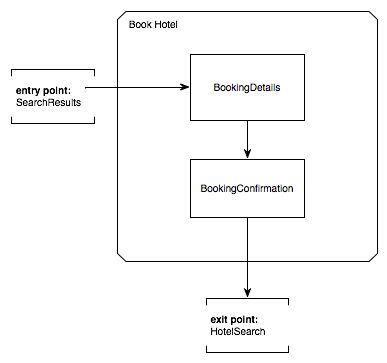

## 3. 定义流程

### 3.1. 介绍

本章从用户部分开始，介绍了如何使用流程定义语言去实现流程。从而让你在读完本章节之后能够很好的理解流程定义语言的结构以及有能力编写一个流程定义。

### 3.2. 流程是什么？

流程（Flow）封装了可在不同上下文中执行的可重用的一系列步骤。下面是一个“[Garrett Information Architecture](http://www.jjg.net/ia/visvocab/)”图，用于说明一个封装了酒店预订步骤的流程（Flow）：

### 3.3. 流程由什么组成？

在Spring Web Flow中，一个典型的流程由一系列称之为“states”的步骤组成。进入一个状态(state)通常会导致向用户显示一个视图。在该视图中，出现的一些 由状态(state)处理的用户事件。这些事件触发后可以转换到其它状态(state)，从而导致页面的导航。

下面的示例显示了上图引用的酒店预订流程的结构：

### 3.4. 如何编写流程？

流程（Flows）由web应用开发者使用一种简单的基于XML的流程定义语言编写而成。本指南的后续步骤将引导你了解流程定义语言的组成元素。

### 3.5. 基本语言元素

#### 3.5.1. flow

每一个流程都由下面的根元素（flow）开始：

~~~xml
<?xml version="1.0" encoding="UTF-8"?>
<flow xmlns="http://www.springframework.org/schema/webflow"
      xmlns:xsi="http://www.w3.org/2001/XMLSchema-instance"
      xsi:schemaLocation="http://www.springframework.org/schema/webflow
                          http://www.springframework.org/schema/webflow/spring-webflow.xsd">

</flow>
~~~

所有的流程状态(states)都必须在这个根元素内进行定义。该元素内定义的第一个状态(state)也是本流程的入口。

#### 3.5.2. view-state

使用`view-state`元素定义一个能够呈现页面视图的步骤：

~~~xml
<view-state id="enterBookingDetails" />
~~~

按照约定，`view-state`通过id映射到与流程定义文件同处一个目录的一个视图模板。举个简单的例子，如果`view-state`对应的流程定义文件存放在`/WEB-INF/hotels/booking`目录，那么上面的`view-state`将会渲染`/WEB-INFO/hotels/booking/enterBookingDetails.xhtml`模板内容。

#### 3.5.3. transition

使用`transition`元素来处理发生在状态(state)内的事件：

~~~xml
<view-state id="enterBookingDetails">
    <transition on="submit" to="reviewBooking" />
</view-state>
~~~

这些 transtions 驱动视图导航。

#### 3.5.4. end-state

使用`end-state`元素来定义流程结果：

~~~xml
<end-state id="bookingCancelled" />
~~~

当流程转换到`end-state`状态时，它将终止并返回结果。

#### 3.5.5. 检查点：基本语言元素

使用`view-state`,`transition`,`end-state`三个元素，你可以快速表达你的视图导航逻辑。团队在添加流程行为之前经常这么做，这样他们就可以首先专注于和最终用户开发应用的用户界面。下面展示了一个简单的流程，该流程使用以上三个元素实现了它的视图导航逻辑：

~~~xml
<flow xmlns="http://www.springframework.org/schema/webflow"
      xmlns:xsi="http://www.w3.org/2001/XMLSchema-instance"
      xsi:schemaLocation="http://www.springframework.org/schema/webflow
                          http://www.springframework.org/schema/webflow/spring-webflow.xsd">

    <view-state id="enterBookingDetails">
        <transition on="submit" to="reviewBooking" />
    </view-state>

    <view-state id="reviewBooking">
        <transition on="confirm" to="bookingConfirmed" />
        <transition on="revise" to="enterBookingDetails" />
        <transition on="cancel" to="bookingCancelled" />
    </view-state>

    <end-state id="bookingConfirmed" />

    <end-state id="bookingCancelled" />

</flow>
~~~

### 3.6. 动作(Actions)

