[TOC]

### 1 环境要求

操作系统：window10

Java环境：JDK1.8、OpenJDK11

项目管理工具：Maven 3.6.3、Gradle 7.1.1

### 2 源码及离线依赖包

江苏项目源码及离线编译依赖包.zip

解压后如下：

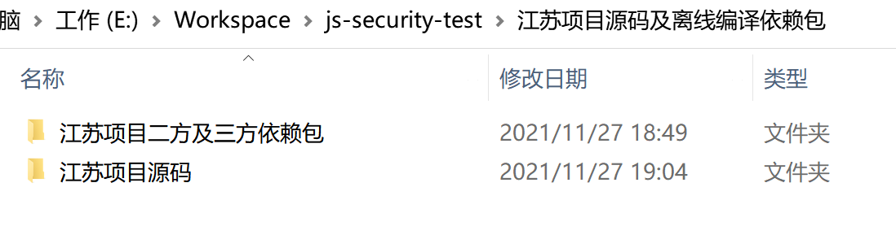

`E:\Workspace\js-security-test\江苏项目源码及离线编译依赖包`目录说明：

~~~powershell
江苏项目源码及离线编译依赖包
├── 江苏项目二方及三方依赖包
│   ├── maven-repository    通用编译依赖包
│   ├── node                xzops-accmp-cmdb 编译依赖环境
│   └── node_modules        xzops-accmp-cmdb 编译依赖包
└── 江苏项目源码
    ├── cas-overlay-template   
    ├── xzops-accmp-cmdb
    ├── xzops-accmp-common
    ├── xzops-accmp-console
    ├── xzops-accmp-core
    ├── xzops-accmp-model
    ├── xzops-accmp-sdh
    └── xzops-commons
~~~

### 3 安装Java环境

1 安装JDK1.8

如示例的安装位置如下：

~~~
C:\Program Files\Java\jdk1.8.0_202
~~~

2 安装OpenJDK11

如示例的安装位置如下：

~~~ 
E:\Development\Environment\Java\openjdk-11
~~~

3 配置系统环境变量

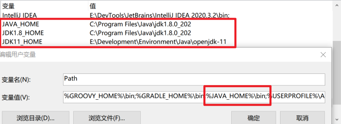

注：不要忘记了将`%JAVA_HOME%\bin;`加入到Path变量值中。

### 4 安装Maven工具

> 注：以下所有操作均在window10下完成。

Maven版本：v3.6.3

下载地址：

https://archive.apache.org/dist/maven/maven-3/3.6.3/binaries/

#### 4.1 安装Maven

下载的软件包直接解压即可，如下

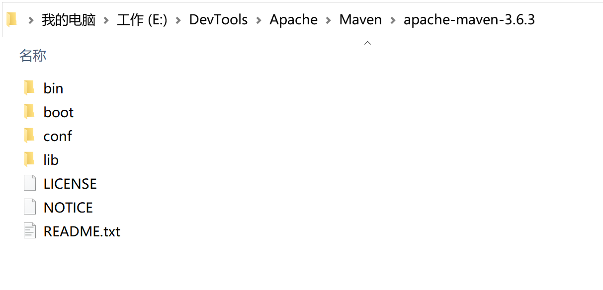

即Maven的Home目录为：E:\DevTools\Apache\Maven\apache-maven-3.6.3

#### 4.2 配置系统变量

在window10环境变量中加入以下配置：

~~~shell
MAVEN_HOME
E:\DevTools\Apache\Maven\apache-maven-3.6.3
~~~

同时在`Path`中添加`%MAVEN_HOME%\bin;`,如下所示

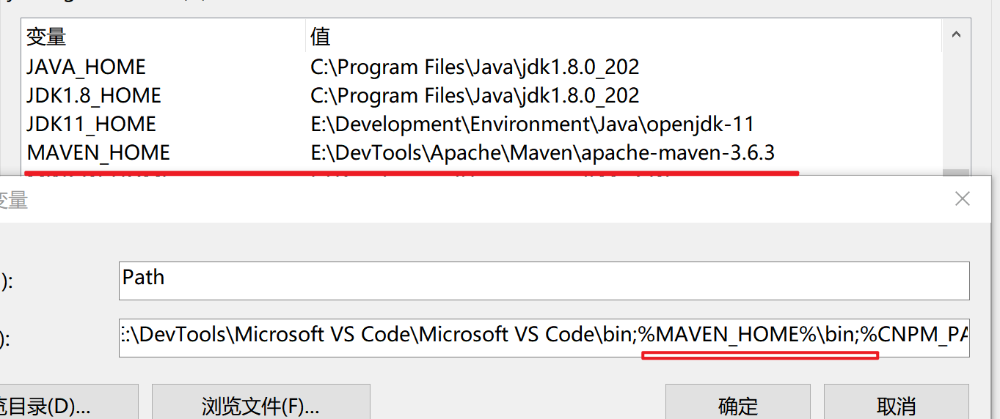

打开`terminal`，输入`mvn -v`输出以下信息即表示安装成功。

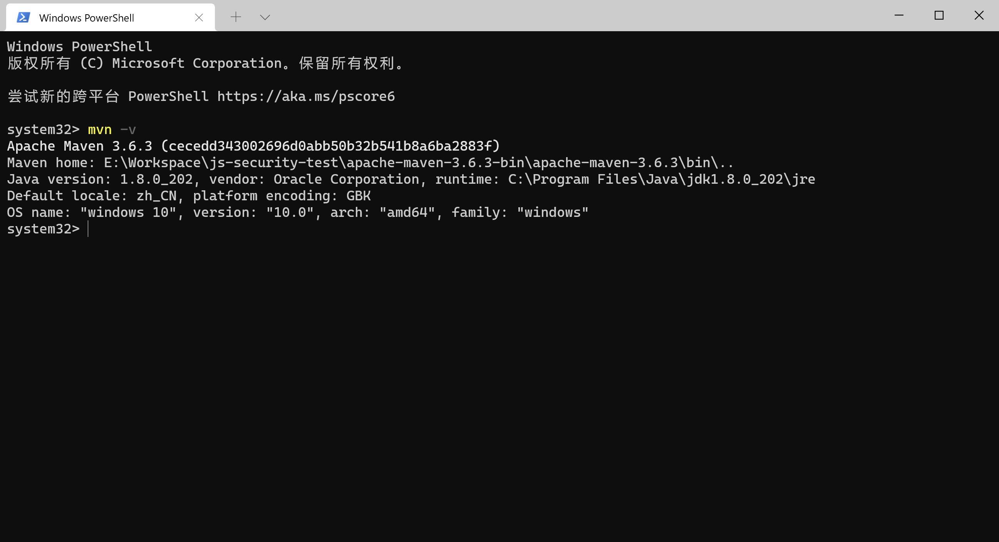

#### 4.3 修改Maven配置文件

用文本编辑器打开Maven的配置文件，参照示例即`E:\DevTools\Apache\Maven\apache-maven-3.6.3\conf\settings.xml`文件。

##### 4.3.1 修改Maven本地仓库位置

默认`<localRepository>`标签是注释掉的，新增一行如下：

~~~xml
<settings xmlns="http://maven.apache.org/SETTINGS/1.0.0"
          xmlns:xsi="http://www.w3.org/2001/XMLSchema-instance"
          xsi:schemaLocation="http://maven.apache.org/SETTINGS/1.0.0 http://maven.apache.org/xsd/settings-1.0.0.xsd">
  <!-- localRepository
   | The path to the local repository maven will use to store artifacts.
   |
   | Default: ${user.home}/.m2/repository
  <localRepository>/path/to/local/repo</localRepository>
  -->
  <localRepository>E:\Workspace\js-security-test\江苏项目源码及离线编译依赖包\江苏项目二方及三方依赖包\maven-repository</localRepository>
  <!-- interactiveMode
   | This will determine whether maven prompts you when it needs input. If set to false,
   | maven will use a sensible default value, perhaps based on some other setting, for
   | the parameter in question.
   |
   | Default: true
  <interactiveMode>true</interactiveMode>
  -->
~~~

注意：该路径只做参考，具体路径请根据实际情况做修改，只要定位到源码包下的`maven-repository`目录即可。

##### 4.3.2 将Maven设置为离线模式

因为源码包提供了编译所需依赖的离线包，无需联网更新依赖信息，所以需要将Maven设置为离线模式。

默认情况下Maven是非离线模式的，我们只需在`settings.xml`文件中找到`<offline>`标签的位置，在其下方新增一行如下：

~~~xml
<!-- offline
   | Determines whether maven should attempt to connect to the network when executing a build.
   | This will have an effect on artifact downloads, artifact deployment, and others.
   |
   | Default: false
  <offline>false</offline>
  -->

  <offline>true</offline>
~~~

保存退出。

### 5 源码编译

如下源码目录中共有8个项目，如下所示：

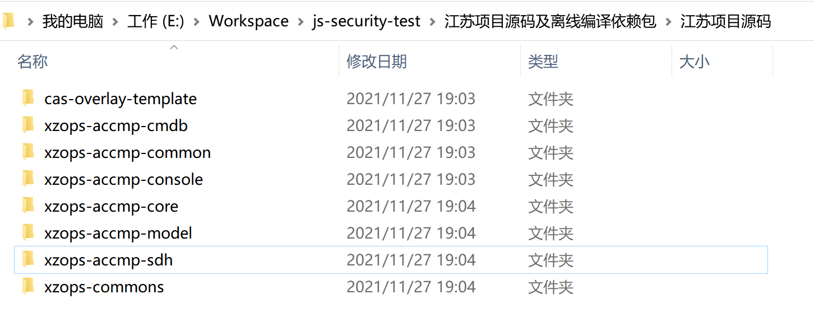

项目说明如下：

| 项目名称             | 项目类型              | 说明                                                         |
| -------------------- | --------------------- | ------------------------------------------------------------ |
| cas-overlay-template | Maven Overlay Project | 中心认证服务系统项目                                         |
| xzops-accmp-console  | Web Project           | 控制台系统的Web项目                                          |
| xzops-accmp-sdh      | Maven pom             | 光传输网管系统项目（包含6个子项目）                          |
| xzops-accmp-cmdb     | Maven pom             | 配置管理数据库系统的父项目（包含2个子项目）                  |
| xzops-accmp-common   | Java Project          | 公共依赖包，包含一些通用的Java类，如全局相关配置类、Security安全相关配置类、数据库连接相关基础类、通用模型类等等。 |
| xzops-accmp-core     | Java Project          | 平台相关核心包。                                             |
| xzops-accmp-model    | Java Project          | 平台相关模型包。                                             |
| xzops-common         | Java Project          | 通用工具类包。                                               |

#### 5.1 编译cas-overlay-template项目

> 注意：
>
> 1、本项目依赖OpenJDK11，因此需要在编译的时候指定JDK版本“'-Dorg.gradle.java.home=[JDK11安装路径]'”。其它项目都依赖JDK1.8，因此在编译时无需特别指定JDK版本（前面已将JDK1.8配置到系统环境中）
>
> 2、本项目使用gradle进行管理，统一使用gradlew命令进行打包。
>
> 3、以下所有指令都在Window10的“Terminal”终端执行完成（使用的PowerShell）

##### 5.1.1 配置环境变量GRADLE_USER_HOME

编译前需把gradle的用户目录也设置成`maven-repository`目录，如下所示：

~~~
GRADLE_USER_HOME
E:\Workspace\js-security-test\江苏项目源码及离线编译依赖包\江苏项目二方及三方依赖包\maven-repository
~~~

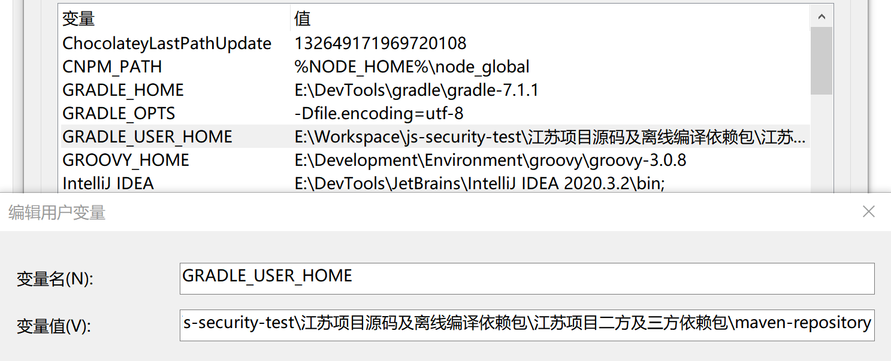

##### 5.1.2 编译项目

打开终端并进入`E:\Workspace\js-security-test\江苏项目源码及离线编译依赖包\江苏项目源码\cas-overlay-template`目录，然后执行命令：

~~~powershell
.\gradlew build --offline '-Dorg.gradle.java.home=E:\Development\Environment\Java\openjdk-11'
~~~

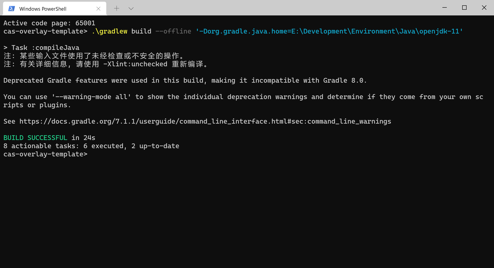

等待编译完成后，源目录新增了一个`build`目录，查找该目录下`build\libs\cas.war`文件，即“中心认证服务系统”的可运行war包。

#### 5.2 编译xzops-accmp-common包

打开终端并进入`E:\Workspace\js-security-test\江苏项目源码及离线编译依赖包\江苏项目源码\xzops-accmp-common`目录，然后执行命令：

~~~powershell
mvn -o install
~~~

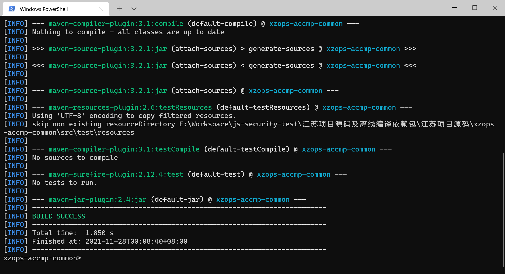

等待编译并打包完成，源目录新增了一个`target`目录，可在该目录下找到生成的`xzops-accmp-common-1.0.9-SNAPSHOT.jar`包，如下所示：

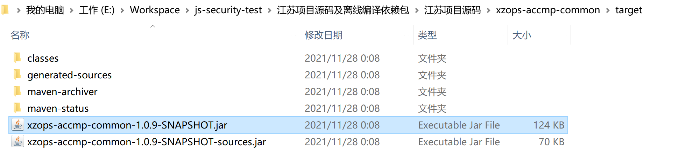

#### 5.3 编译xzops-common包

打开终端并进入`E:\Workspace\js-security-test\江苏项目源码及离线编译依赖包\江苏项目源码\xzops-commons`目录，然后执行命令：

~~~powershell
mvn -o install
~~~

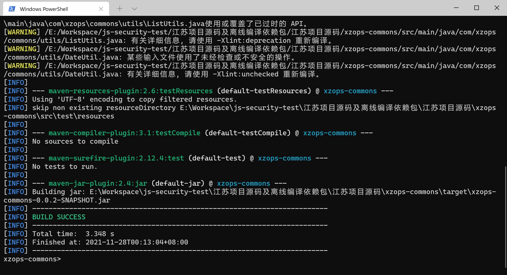

等待编译并打包完成，源目录新增了一个`target`目录，可在该目录下找到生成的`xzops-commons-0.0.2-SNAPSHOT.jar`包，如下所示：

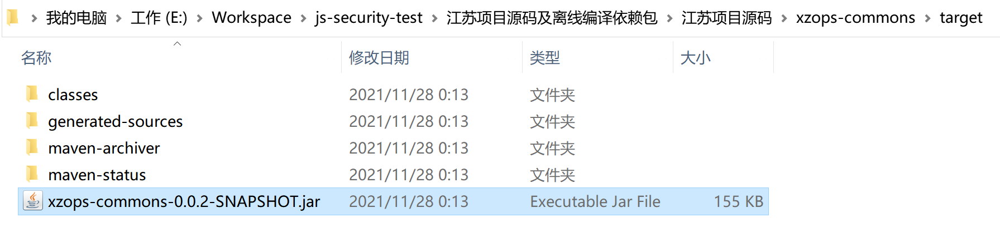

#### 5.4 编译xzops-accmp-model包

打开终端并进入`E:\Workspace\js-security-test\江苏项目源码及离线编译依赖包\江苏项目源码\xzops-accmp-model`目录，然后执行命令：

~~~powershell
mvn -o install
~~~

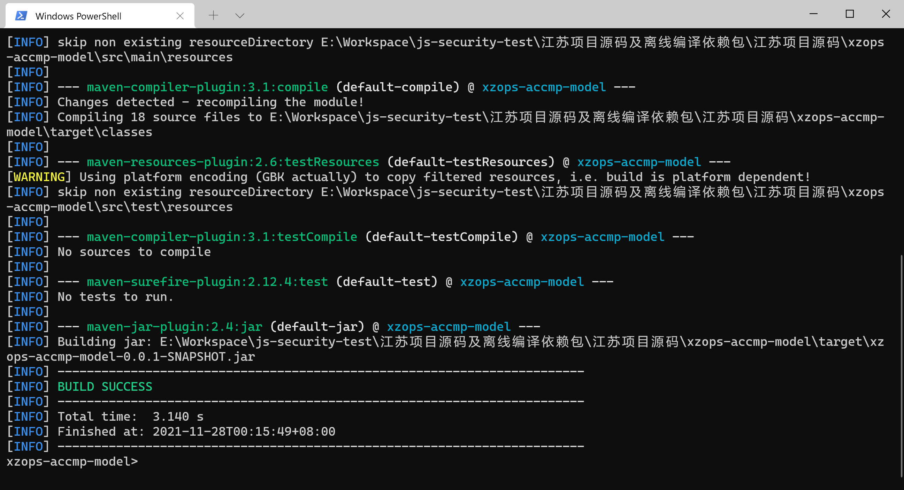

等待编译并打包完成，源目录新增了一个`target`目录，可在该目录下找到生成的`xzops-accmp-model-0.0.1-SNAPSHOT.jar`包，如下所示：

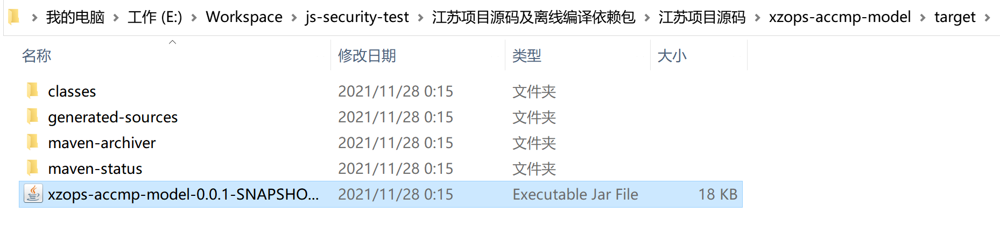

#### 5.5 编译xzops-accmp-core包

打开终端并进入`E:\Workspace\js-security-test\江苏项目源码及离线编译依赖包\江苏项目源码\xzops-accmp-core`目录，然后执行命令：

~~~powershell
mvn -o install
~~~

等待编译并打包完成，源目录新增了一个`target`目录，可在该目录下找到生成的`xzops-accmp-core-0.0.2-SNAPSHOT.jar`包，如下所示：

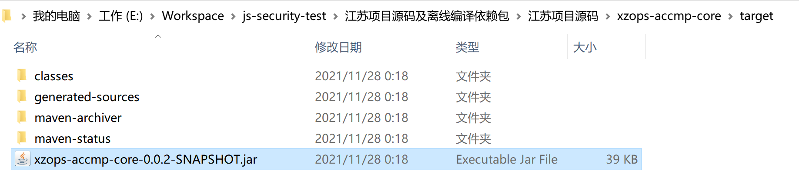

#### 5.6 编译xzops-accmp-console项目

打开终端并进入`E:\Workspace\js-security-test\江苏项目源码及离线编译依赖包\江苏项目源码\xzops-accmp-console`目录，然后执行命令：

~~~powershell
mvn -o package
~~~

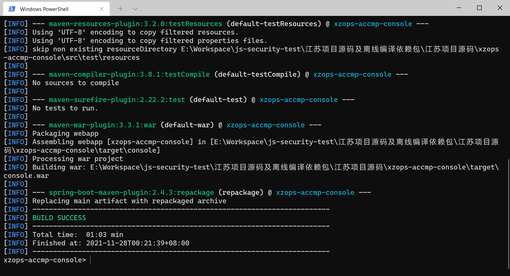

等待编译完成后，源目录新增了一个`target`目录，可在该目录下找到生成的`console.war`文件，即“控制台系统”的可运行war包。

#### 5.7 编译xzops-accmp-sdh项目

打开终端并进入`E:\Workspace\js-security-test\江苏项目源码及离线编译依赖包\江苏项目源码\xzops-accmp-sdh`目录，然后执行命令：

~~~powershell
mvn -o package
~~~

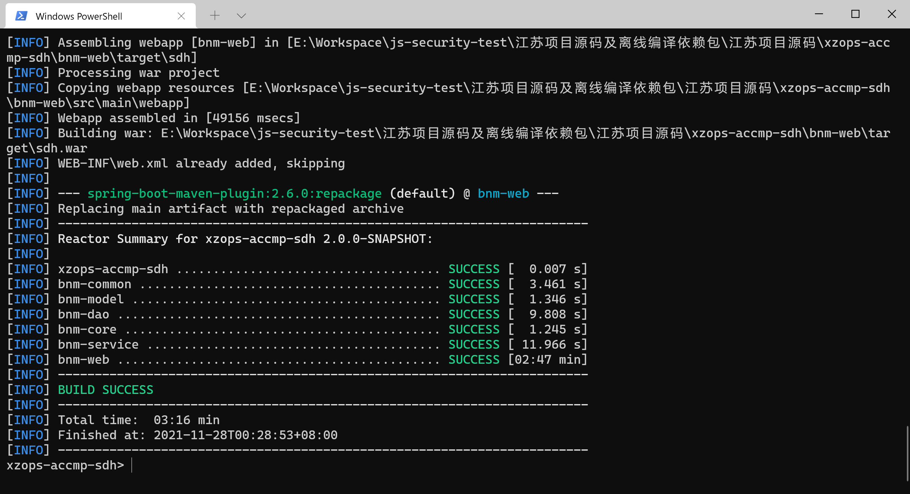

等待编译完成后，可在`.\bnm-web\target`目录下找到生成的`sdh.war`文件，即“光传输网管系统”的可运行war包。

#### 5.8 编译xzops-accmp-cmdb项目

> 注意：编译该项目前，需要把`E:\Workspace\js-security-test\江苏项目源码及离线编译依赖包\江苏项目二方及三方依赖包`目录下的`node`和`node_modules`两个目录文件复制到`E:\Workspace\js-security-test\江苏项目源码及离线编译依赖包\江苏项目源码\xzops-accmp-cmdb\cmdb-ui`目录中。(以上目录的绝对路径是演示机器所在路径，实操时根据所在机器源码包解压路径确定)

打开终端并进入`E:\Workspace\js-security-test\江苏项目源码及离线编译依赖包\江苏项目源码\xzops-accmp-cmdb`目录，然后执行命令：

~~~powershell
mvn -o package
~~~

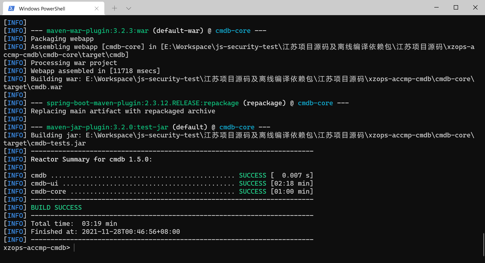

等待编译完成后，可在`xzops-accmp-cmdb\cmdb-core\target`目录下找到生成的`cmdb.war`文件，即“配置管理数据库系统”的可运行war包。

注意：执行到以下位置时，并不是编译出错了，等待片刻即可。

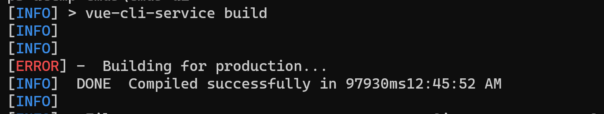

至此所有项目编译完成。
